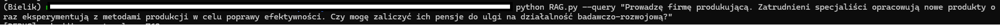
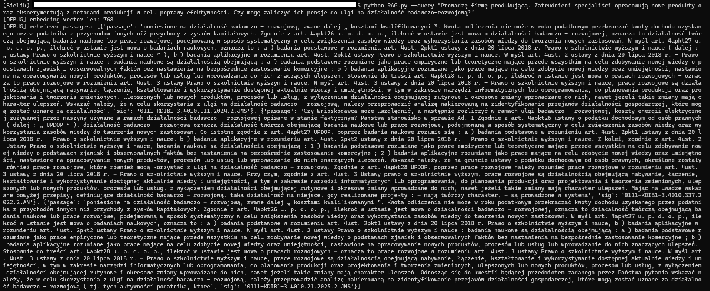
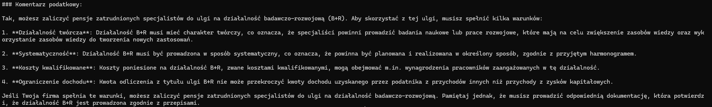

[English version below](#english-version-below)

# Projekt RAG (Retriever-Augmented Generation)
**rag-tax-commentary**

Zaawansowany system Retrieval-Augmented Generation do automatycznego generowania komentarzy podatkowych na podstawie interpretacji indywidualnych, wykorzystujący **LangChain**, model **Bielik LLM** oraz bazę wektorową **Weaviate**.

---

## Spis treści
- [Cel projektu](#cel-projektu)
- [Technologie](#technologie)
- [Przykład użycia](#przykład-użycia)
- [Automatyczna analiza statystyk i raportowanie](#automatyczna-analiza-statystyk-i-raportowanie)
- [Struktura repozytorium](#struktura-repozytorium)
- [Kontakt](#kontakt)

---

## Cel projektu

Celem projektu jest stworzenie narzędzia, które na podstawie interpretacji podatkowych potrafi w zrozumiały sposób odpowiadać na pytania dotyczące prawa podatkowego. System automatycznie wyszukuje najtrafniejsze fragmenty interpretacji (retrieval), a następnie generuje precyzyjne komentarze podatkowe z użyciem dużego modelu językowego (Bielik LLM). Pipeline korzysta z nowoczesnych frameworków **LangChain** oraz **Weaviate**.

---

## Technologie

- **Python 3.12+**
- **[LangChain](https://python.langchain.com/)** — framework do budowy pipeline’ów RAG, zarządzania przepływem danych (retriever, LLM, monitoring, analizy)
- **[Weaviate](https://weaviate.io/)** — baza danych wektorowych (przechowuje zakodowane fragmenty interpretacji, umożliwia wyszukiwanie semantyczne)
- **[HuggingFace Transformers](https://huggingface.co/docs/transformers/)** — embeddingi tekstów do przestrzeni wektorowej
- **Bielik LLM** — polskojęzyczny model generatywny (REST API)
- **pandas** — przetwarzanie i czyszczenie danych
- **numpy** — operacje matematyczne/statystyczne
- **matplotlib** — generowanie wykresów (histogramy, itp.)
- **requests** — komunikacja HTTP z serwerem Bielik
- **re** — zaawansowane operacje tekstowe (regex)
- **dotenv** — obsługa zmiennych środowiskowych
- **Docker** — uruchamianie serwera embeddingowego i bazy Weaviate

**Pliki:**
- [csv_document_loader.py](Rag/csv_document_loader.py) — ładowanie i chunkowanie danych CSV
- [weaviate_ingest.py](Rag/weaviate_ingest.py) — indeksowanie dokumentów, zarządzanie schematem i połączenie z bazą Weaviate
- [retriever.py](Rag/retriever.py) — retriever oparty na LangChain (wyszukiwanie najbardziej relewantnych fragmentów)
- [llms.py](Rag/llms.py) — komunikacja i budowa promptów dla Bielik LLM
- [pipeline.py](Rag/pipeline.py) — główny pipeline RAG (terminal)
- [generate_stats.py](Rag/generate_stats.py) — automatyczna analiza, zbieranie statystyk i generowanie raportów/wykresów na podstawie realnych pytań

---

## Przykład użycia

Prototyp systemu obejmuje ~4500 interpretacji podatkowych.  
Obecna wersja **nie posiada interfejsu webowego** – pytania zadawane są w terminalu.

1. **Uruchom wymagane serwery** (Weaviate, Bielik LLM, embedding server) – zgodnie z dokumentacją lub dockerami.
2. **Dodaj dane (CSV)** i zaindeksuj je do bazy Weaviate (jeśli nie masz jeszcze bazy).
3. **Zadaj pytanie w terminalu** (przykład):

    ```bash
    python pipeline.py -q "Czy można zaliczyć pensje inżynierów do ulgi na działalność badawczo-rozwojową?"
    ```
  (images/image1.png)
  
    Odpowiedź pojawi się w terminalu oraz zostanie zapisana do logu (`qa_history_log.csv`).

4. **Po zadaniu serii pytań** możesz wygenerować statystyki, ranking chunków i automatyczne raporty do README:

    ```bash
    python generate_stats.py
    ```

    W katalogu pojawią się m.in.: `retrieval_report.md`, `chunk_ranking.csv`, `chunk_length_hist.png`, `retrieval_stats_summary.md`.

---

## Automatyczna analiza statystyk i raportowanie

- **System loguje każde pytanie i odpowiedź** do pliku `qa_history_log.csv`
- **[generate_stats.py](Rag/generate_stats.py)** analizuje rzeczywistą historię zapytań:
    - Liczbę i długość chunków
    - Ranking najczęściej przywoływanych fragmentów
    - Czasy odpowiedzi
    - Histogramy, rozkład embeddingów, itp.
    - Gotowe raporty Markdown do README lub prezentacji

**Przykładowe raporty/statystyki znajdziesz w plikach:**
- [retrieval_report.md](Rag/retrieval_report.md)
- [retrieval_stats_summary.md](Rag/retrieval_stats_summary.md)
- [chunk_ranking.csv](Rag/chunk_ranking.csv)
- (oraz obrazy PNG z wykresami)

---

## Struktura repozytorium

Ze względu na ograniczenia dotyczące rozmiaru plików na GitHub, repozytorium nie zawiera bazy wektorowej ani pliku CSV z tekstami interpretacji.

repo_root/
│
├── [bielik_aws_deploy/](bielik_aws_deploy/)
│   ├── [Requirements.txt](bielik_aws_deploy/Requirements.txt)
│   ├── [Run_bielik.sh](bielik_aws_deploy/Run_bielik.sh)
│   └── [Server.py](bielik_aws_deploy/Server.py)
│
├── [Rag/](Rag/)
│   ├── [dockerfiles/](Rag/dockerfiles/)
│   │   ├── [Run_embedding_model.sh](Rag/dockerfiles/Run_embedding_model.sh)
│   │   └── [Run_vector_db.sh](Rag/dockerfiles/Run_vector_db.sh)
│   ├── [csv_document_loader.py](Rag/csv_document_loader.py)
│   ├── [weaviate_ingest.py](Rag/weaviate_ingest.py)
│   ├── [retriever.py](Rag/retriever.py)
│   ├── [llms.py](Rag/llms.py)
│   ├── [pipeline.py](Rag/pipeline.py)
│   ├── [generate_stats.py](Rag/generate_stats.py)
│   ├── [config.py](Rag/config.py)
│   ├── [retrieval_report.md](Rag/ retrieval_report.md)
│   └── [retrieval_stats_summary.md](Rag/retrieval_stats_summary.md)
│├── [images/](images/)
│   ├── [image1.png](images/image1.png)
│   ├── [image2.png](images/image2.png)
│   ├── [image3.png](images/image3.png)
│
└── [README.md](README.md)---

## Kontakt

Projekt na licencji otwartej.  
Zapraszam do współpracy:  
- [LinkedIn: Michał Jaros](https://www.linkedin.com/in/michał-jaros-88572821a/)  
- E-mail: michal.marek.jaros@gmail.com

## English version below
# RAG Project (Retriever-Augmented Generation)
**rag-tax-commentary**  
A Retrieval-Augmented Generation system for automatically creating tax commentaries based on individual rulings, leveraging the Bielik LLM and the Weaviate vector database.

## Table of Contents
- [Project Aim](#project-aim)
- [Technologies](#technologies)
- [Usage Example](#usage-example)
- [Repository Structure](#repository-structure)
- [Contact](#contact)

## Project Aim
The aim of this project is to create a tool that, based on tax rulings, provides accessible answers to questions about tax law. Tax authorities have issued over half a million individual rulings explaining the interpretation of regulations. Finding rulings that contain key information can be time-consuming, so there is room for systems that speed up this process and generate concise summaries that clearly address the user’s question.

## Technologies
- **Python 3.12.3**  
  The primary runtime environment and programming language.
- **requests**  
  Sending HTTP requests (data retrieval, API communication).
- **weaviate**  
  Client for the Weaviate vector database (document indexing, semantic search).
- **pandas**  
  DataFrame-based data manipulation and analysis (loading and cleaning source data).
- **re (Regular Expressions)**  
  Advanced text operations (parsing, cleaning).
- **transformers (AutoTokenizer)**  
  Text tokenization before language model inference.
- **litserve**  
  Serving the LLM via REST endpoints, enabling easy frontend integration.
- **vllm (LLM, SamplingParams)**  
  Efficient language model inference (parallel request processing, generation parameter configuration).

With this toolset, the RAG application consists of three main layers:
1. **Retriever Module**  
   - Indexing and searching information in Weaviate  
   - Data preprocessing in Pandas  
   - Caching query results
2. **Generative Module**  
   - Tokenization in Transformers  
   - Efficient inference in VLLM  
   - Sending queries to the local Bielik model or the OpenAI API
3. **Serving Layer**  
   - Litserve to expose an HTTP API and handle user requests

Each of these libraries plays a specific role in the project architecture, allowing for a scalable and flexible RAG pipeline.

## Usage Example
The work resulted in a prototype containing about 4,500 individual rulings. The current version does not have a web interface; questions must be asked in the terminal.

1. The user types a question (e.g., about a specific tax issue).  
   

2. Using vector search, the system finds ruling fragments that match the submitted question.  
   

3. The submitted question and the selected ruling fragments are added to the prompt and sent to the Bielik model. The large language model generates a clear and concise answer.  
   

In this example, the word “pensja” (salary) was used in the question to check whether the vector search correctly associates it with the term “wynagrodzenie” (remuneration), which is used in the law and individual rulings.

## Repository Structure
Due to GitHub file size restrictions, the vector database and the CSV file with raw ruling texts are not included in the repository.

The repository consists of the following elements:
```
├── bielik_aws_deploy/
│ ├── Requirements.txt
│ ├── Run_bielik.sh
│ └── Server.py
├── Rag/
│ ├── dockerfiles/
│ │ ├── Run_embedding_model.sh
│ │ └── Run_vector_db.sh
│ │
│ ├── Ingest_data.py
│ ├── rag.py
│ └── Requirements.txt
└── images/
├── image1.png
├── image2.png
└── image3.png
```
- **bielik_aws_deploy/**  
  Contains files needed to deploy the Bielik model on an AWS EC2 instance:  
  - `Requirements.txt` – list of Python dependencies to run the Bielik server.  
  - `Run_bielik.sh` – Docker script to start the server and collect logs.  
  - `Server.py` – server code exposing endpoints for Bielik model inference.

- **Rag/**  
  Implementation of the RAG pipeline:  
  - `dockerfiles/`  
    - `Run_embedding_model.sh` – Docker script to start the embedding model (silver-retriever-base-v1).  
    - `Run_vector_db.sh` – Docker script to start the Weaviate vector database.  
  - `Ingest_data.py` – Python script that builds the vector database, processes ruling text, performs chunking and tokenization. The script uses domain knowledge to treat references like “art. 18d ust. 1 pkt 1” as a single token—by removing unnecessary spaces, legal references have more accurate representations.  
  - `rag.py` – main Python script that runs the full RAG pipeline: sets up the system prompt, retrieves information from the vector database, configures LLM hyperparameters, and sends the query to the Bielik model server.  
  - `Requirements.txt` – list of Python dependencies for the RAG module.

- **images/**  
  Directory with image files used in the “Usage Example” section.

## Contact
This project is released under an open-source license. Anyone interested in collaborating on a tool for streamlined tax regulation review is welcome to get in touch:  
- LinkedIn: [michał-jaros-88572821a](https://www.linkedin.com/in/michał-jaros-88572821a/)  
- E-mail: michal.marek.jaros@gmail.com  

