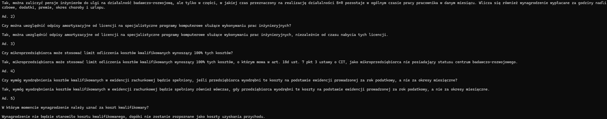

# English version below

# Projekt RAG (Retriever-Augmented Generation)
**rag-tax-commentary**  
Retrieval-Augmented Generation system do automatycznego tworzenia komentarzy podatkowych na bazie interpretacji indywidualnych, wykorzystujący model Bielik LLM oraz bazę wektorową Weaviate.

## Spis treści
- [Cel projektu](#cel-projektu)
- [Technologie](#technologie)
- [Przykład użycia](#przykład-użycia)
- [Struktura repozytorium](#struktura-repozytorium)
- [Kontakt](#kontakt)

## Cel projektu
Celem projektu jest stworzenie narzędzia, które na podstawie interpretacji podatkowych w przystępny sposób odpowie na pytania dotyczące prawa podatkowego. Organy podatkowe wydały ponad pół miliona interpretacji indywidualnych, w których wyjaśniały wykładnię przepisów. Odnalezienie interpretacji zawierających kluczowe informacje bywa czasochłonne, dlatego istnieje przestrzeń dla systemów przyspieszających ten proces oraz generujących zwięzłe podsumowania jasno odpowiadające na pytanie użytkownika.

## Technologie
- **Python 3.12.3**  
  Główne środowisko wykonawcze i język programowania.
- **requests**  
  Wysyłanie zapytań HTTP (pobieranie danych, komunikacja z API).
- **weaviate**  
  Klient do bazy wektorowej Weaviate (indeksowanie dokumentów, wyszukiwanie semantyczne).
- **pandas**  
  Manipulacja i analiza danych w formie DataFrame (wczytywanie i oczyszczanie danych źródłowych).
- **re (Regular Expressions)**  
  Zaawansowane operacje na tekście (parsowanie, czyszczenie).
- **transformers (AutoTokenizer)**  
  Tokenizacja tekstu przed inferencją modeli językowych.
- **litserve**  
  Serwowanie modelu LLM poprzez endpointy REST, ułatwiające integrację z frontendem.
- **vllm (LLM, SamplingParams)**  
  Wydajna inferencja modeli językowych (równoległe przetwarzanie zapytań, konfiguracja parametrów generowania).

Dzięki temu zestawowi narzędzi aplikacja RAG składa się z trzech głównych warstw:
1. **Moduł Retrievera**  
   - Indeksowanie i wyszukiwanie informacji w Weaviate  
   - Preprocessing danych w Pandas  
   - Caching wyników zapytań
2. **Moduł Generatywny**  
   - Tokenizacja w Transformers  
   - Wydajna inferencja w VLLM  
   - Wysyłanie zapytań do lokalnego modelu Bielik lub do API OpenAI
3. **Warstwa Serwowania**  
   - Litserve do wystawienia API HTTP i obsługi żądań użytkowników

Każda z wymienionych bibliotek pełni określoną rolę w architekturze projektu, co pozwala na skalowalny i elastyczny pipeline RAG.

## Przykład użycia
W wyniku prac powstał prototyp zawierający około 4500 interpretacji indywidualnych. Obecna wersja nie posiada interfejsu webowego; pytania należy zadawać w terminalu.

1. Użytkownik wpisuje pytanie (np. o konkretną kwestię podatkową).  
   

2. System za pomocą wyszukiwania wektorowego odnajduje fragmenty interpretacji, które odpowiadają na zadane pytanie.  
   

3. Zadane pytanie oraz wybrane fragmenty interpretacji trafiają do promptu i są przesyłane do modelu Bielik. Duży model językowy generuje jasną i zwięzłą odpowiedź.  
   

W przykładzie w pytaniu użyto słowa „pensja”, aby sprawdzić, czy wyszukiwanie wektorowe poprawnie skojarzy je z terminem „wynagrodzenie”, stosowanym w ustawie oraz interpretacjach indywidualnych.

## Struktura repozytorium
Ze względu na ograniczenia dotyczące rozmiaru plików na GitHubie, w repozytorium nie zamieszczono wektorowej bazy danych ani pliku CSV z surowymi tekstami interpretacji.

Repozytorium składa się z następujących elementów:
```
├── bielik_aws_deploy/
│ ├── Requirements.txt
│ ├── Run_bielik.sh
│ └── Server.py
├── Rag/
│ ├── dockerfiles/
│ │ ├── Run_embedding_model.sh
│ │ └── Run_vector_db.sh
│ │
│ ├── Ingest_data.py
│ ├── rag.py
│ └── Requirements.txt
└── images/
├── image1.png
├── image2.png
└── image3.png
```
- **bielik_aws_deploy/**  
  Zawiera pliki potrzebne do uruchomienia modelu Bielik na instancji AWS EC2:
  - `Requirements.txt` – lista zależności Pythona do uruchomienia serwera Bielik.  
  - `Run_bielik.sh` – skrypt Docker do uruchamiania serwera i zbierania logów.  
  - `Server.py` – kod serwera wystawiającego endpointy do inferencji modelu Bielik.

- **Rag/**  
  Implementacja pipeline RAG:
  - `dockerfiles/`  
    - `Run_embedding_model.sh` – skrypt Docker do uruchamiania modelu embeddingowego (silver-retriever-base-v1).  
    - `Run_vector_db.sh` – skrypt Docker do uruchamiania bazy wektorowej Weaviate.  
  - `Ingest_data.py` – skrypt Pythona tworzący wektorową bazę danych, modyfikujący tekst interpretacji, przeprowadzający chunking i tokenizację. W kodzie wykorzystano wiedzę dziedzinową, aby np. „art. 18d ust. 1 pkt 1” był traktowany jako pojedynczy token – skrypt usuwa zbędne spacje, dzięki czemu odniesienia do konkretnych przepisów mają dokładniejsze reprezentacje.  
  - `rag.py` – główny skrypt Pythona uruchamiający pełny pipeline RAG: definiuje prompt systemowy, pobiera informacje z bazy wektorowej, ustala hiperparametry LLM-u i wysyła zapytanie do serwera z modelem Bielik.  
  - `Requirements.txt` – lista zależności Pythona dla modułu RAG.

- **images/**  
  Katalog z plikami graficznymi używanymi w sekcji „Przykład użycia”.

## Kontakt
Projekt udostępniony jest na licencji otwartej. Osoby zainteresowane wspólnym rozwojem narzędzia do usystematyzowanego przeglądu przepisów podatkowych zapraszam do kontaktu:  
- LinkedIn: [michał-jaros-88572821a](https://www.linkedin.com/in/michał-jaros-88572821a/)  
- E-mail: michal.marek.jaros@gmail.com  


# RAG Project (Retriever-Augmented Generation)
**rag-tax-commentary**  
A Retrieval-Augmented Generation system for automatically creating tax commentaries based on individual rulings, leveraging the Bielik LLM and the Weaviate vector database.

## Table of Contents
- [Project Aim](#project-aim)
- [Technologies](#technologies)
- [Usage Example](#usage-example)
- [Repository Structure](#repository-structure)
- [Contact](#contact)

## Project Aim
The aim of this project is to create a tool that, based on tax rulings, provides accessible answers to questions about tax law. Tax authorities have issued over half a million individual rulings explaining the interpretation of regulations. Finding rulings that contain key information can be time-consuming, so there is room for systems that speed up this process and generate concise summaries that clearly address the user’s question.

## Technologies
- **Python 3.12.3**  
  The primary runtime environment and programming language.
- **requests**  
  Sending HTTP requests (data retrieval, API communication).
- **weaviate**  
  Client for the Weaviate vector database (document indexing, semantic search).
- **pandas**  
  DataFrame-based data manipulation and analysis (loading and cleaning source data).
- **re (Regular Expressions)**  
  Advanced text operations (parsing, cleaning).
- **transformers (AutoTokenizer)**  
  Text tokenization before language model inference.
- **litserve**  
  Serving the LLM via REST endpoints, enabling easy frontend integration.
- **vllm (LLM, SamplingParams)**  
  Efficient language model inference (parallel request processing, generation parameter configuration).

With this toolset, the RAG application consists of three main layers:
1. **Retriever Module**  
   - Indexing and searching information in Weaviate  
   - Data preprocessing in Pandas  
   - Caching query results
2. **Generative Module**  
   - Tokenization in Transformers  
   - Efficient inference in VLLM  
   - Sending queries to the local Bielik model or the OpenAI API
3. **Serving Layer**  
   - Litserve to expose an HTTP API and handle user requests

Each of these libraries plays a specific role in the project architecture, allowing for a scalable and flexible RAG pipeline.

## Usage Example
The work resulted in a prototype containing about 4,500 individual rulings. The current version does not have a web interface; questions must be asked in the terminal.

1. The user types a question (e.g., about a specific tax issue).  
   

2. Using vector search, the system finds ruling fragments that match the submitted question.  
   

3. The submitted question and the selected ruling fragments are added to the prompt and sent to the Bielik model. The large language model generates a clear and concise answer.  
   

In this example, the word “pensja” (salary) was used in the question to check whether the vector search correctly associates it with the term “wynagrodzenie” (remuneration), which is used in the law and individual rulings.

## Repository Structure
Due to GitHub file size restrictions, the vector database and the CSV file with raw ruling texts are not included in the repository.

The repository consists of the following elements:
```
├── bielik_aws_deploy/
│ ├── Requirements.txt
│ ├── Run_bielik.sh
│ └── Server.py
├── Rag/
│ ├── dockerfiles/
│ │ ├── Run_embedding_model.sh
│ │ └── Run_vector_db.sh
│ │
│ ├── Ingest_data.py
│ ├── rag.py
│ └── Requirements.txt
└── images/
├── image1.png
├── image2.png
└── image3.png
```
- **bielik_aws_deploy/**  
  Contains files needed to deploy the Bielik model on an AWS EC2 instance:  
  - `Requirements.txt` – list of Python dependencies to run the Bielik server.  
  - `Run_bielik.sh` – Docker script to start the server and collect logs.  
  - `Server.py` – server code exposing endpoints for Bielik model inference.

- **Rag/**  
  Implementation of the RAG pipeline:  
  - `dockerfiles/`  
    - `Run_embedding_model.sh` – Docker script to start the embedding model (silver-retriever-base-v1).  
    - `Run_vector_db.sh` – Docker script to start the Weaviate vector database.  
  - `Ingest_data.py` – Python script that builds the vector database, processes ruling text, performs chunking and tokenization. The script uses domain knowledge to treat references like “art. 18d ust. 1 pkt 1” as a single token—by removing unnecessary spaces, legal references have more accurate representations.  
  - `rag.py` – main Python script that runs the full RAG pipeline: sets up the system prompt, retrieves information from the vector database, configures LLM hyperparameters, and sends the query to the Bielik model server.  
  - `Requirements.txt` – list of Python dependencies for the RAG module.

- **images/**  
  Directory with image files used in the “Usage Example” section.

## Contact
This project is released under an open-source license. Anyone interested in collaborating on a tool for streamlined tax regulation review is welcome to get in touch:  
- LinkedIn: [michał-jaros-88572821a](https://www.linkedin.com/in/michał-jaros-88572821a/)  
- E-mail: michal.marek.jaros@gmail.com  

